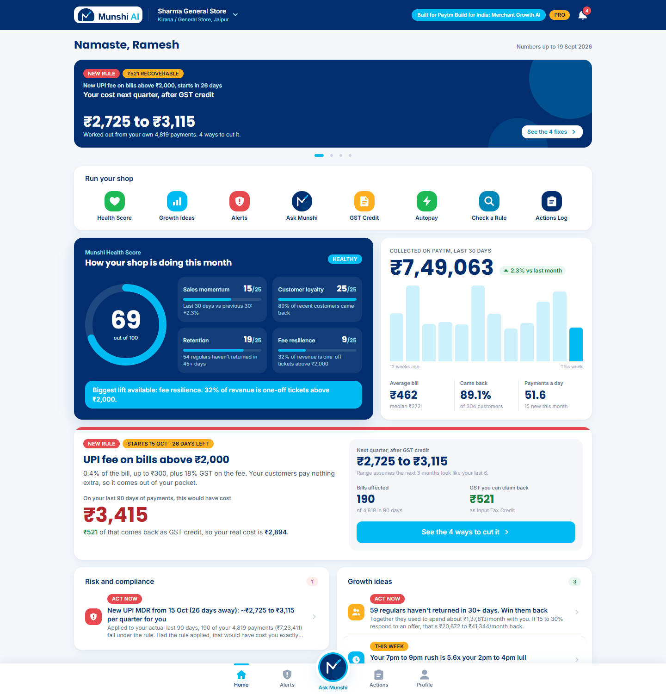
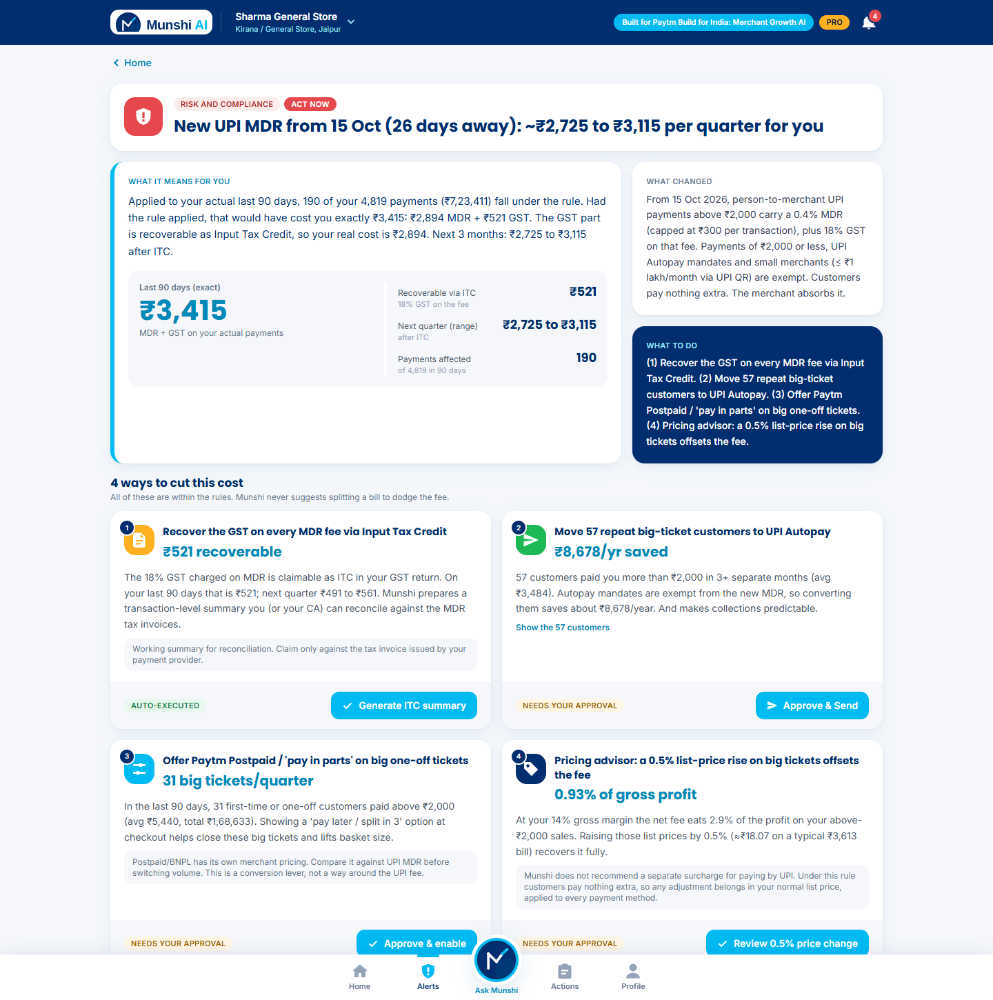
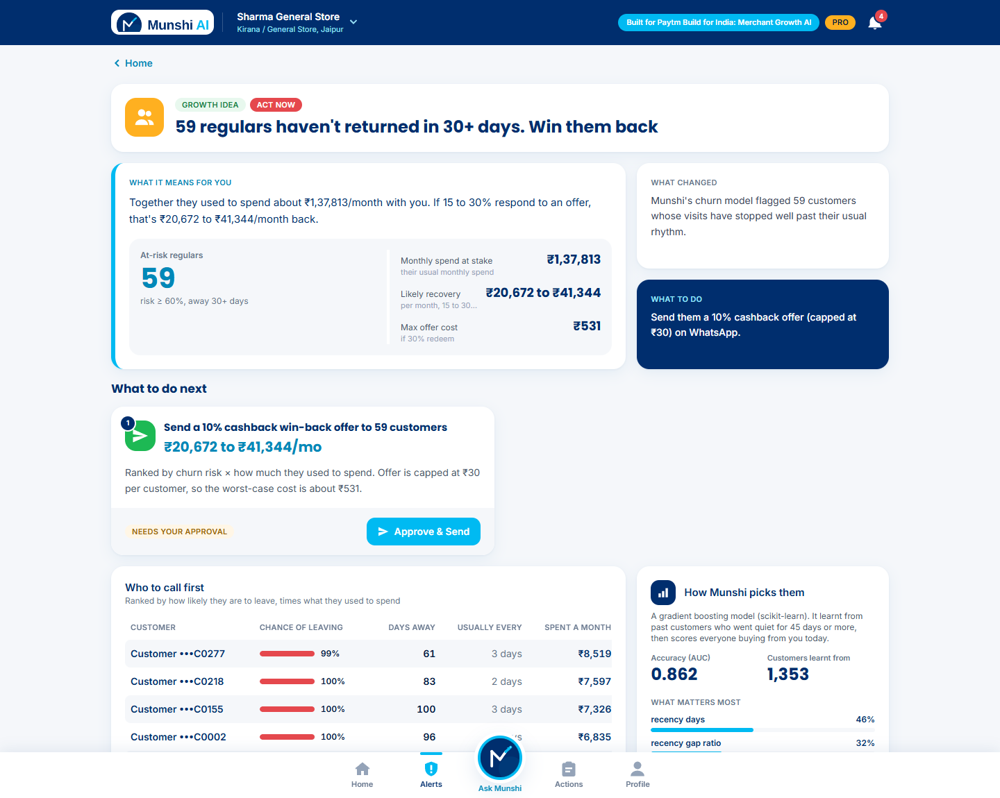
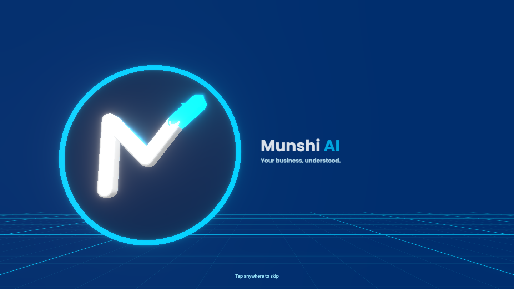
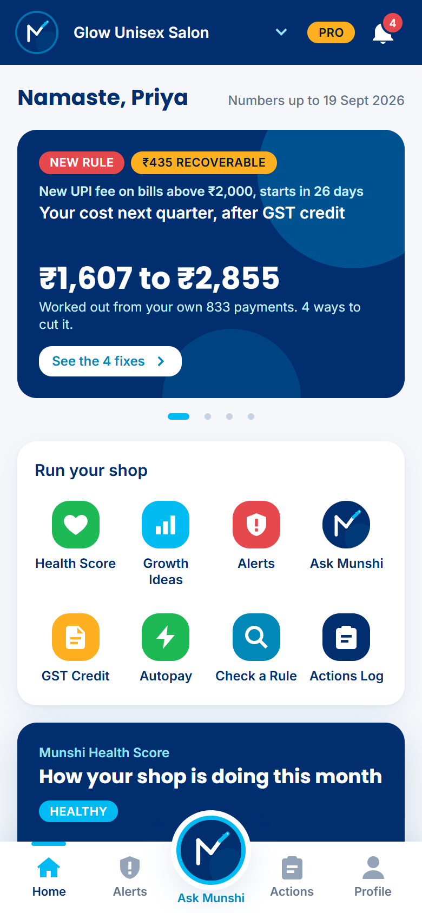

# Munshi AI — Paytm Merchant Growth Copilot

> Built for **Paytm "Build for India" AI Hackathon — Track 1: Merchant Growth AI**

Munshi AI is an AI copilot for Paytm merchants built on one core idea: a **Merchant Signal Engine** that reads a merchant's own transaction data and turns any signal (a new regulation, a growth opportunity, a customer about to leave) into:

1. **What changed**
2. **Exactly how it affects *you*** (in rupees, computed from your own payments)
3. **What to do about it** (a one-tap, human-approved action)

Two agent modules plug into the engine today:

| Agent | Tier | What it does |
|---|---|---|
| **Regulatory Impact Agent** (flagship) | Free alerts, Pro actions | Models the Oct 2026 UPI MDR + GST rule on the merchant's real history: an exact 90-day cost, a forward **range** with its assumption stated, and 4 compliant fixes. It also reads new regulation text live. |
| **Growth Opportunity Agent** | Pro | ML churn prediction with a win-back offer, peak-hour staffing and happy-hour suggestions, and a "merchants like you" benchmark. |

New agents slot in without touching the core (see [Adding an agent](#adding-a-new-agent)).

---



*Home: health score, the new UPI fee in rupees, alerts split into risk and growth.*

| The flagship alert | Churn win-back |
|---|---|
| [](docs/img/alert-mdr.png) | [](docs/img/churn.png) |
| The Oct 2026 UPI MDR rule applied to this shop's own 90 days: an exact cost, a forward range with its assumption, and 4 compliant fixes. | A scikit-learn churn model ranks customers who stopped coming, and turns that into a one-tap cashback offer. |

| 3D launch screen | On a phone |
|---|---|
| [](docs/img/splash-3d.png) | [](docs/img/mobile.png) |

---

## The rule, modelled precisely

- From **15 Oct 2026**: **0.4% MDR**, **capped at ₹300 per transaction**, on P2M UPI payments **above ₹2,000**.
- **18% GST on the MDR fee itself** (not on the payment). The GST is recoverable as **Input Tax Credit**.
- **Exempt:** payments of ₹2,000 or less; recurring UPI Autopay / mandate payments (at any amount); small merchants receiving **≤ ₹1 lakh/month via UPI QR**.
- Consumers pay nothing extra, so the merchant absorbs the fee.

> **Deliberate exclusion:** there is **no transaction-splitting or fee-avoidance logic anywhere** in the code (see the header of `backend/app/agents/regulatory.py`), and the LLM prompts carry the same guardrail. Every recommendation is a compliant lever: ITC recovery, Autopay for genuinely recurring payers, a different payment instrument for big tickets, or an informed list-price decision (never a UPI surcharge).

## Features

**Layer 1: Understand (free)**
- Business Health Score (0–100, four explainable components), revenue trend, average ticket, repeat-customer %, transaction mix (≤₹2,000 / >₹2,000 one-off / recurring-exempt), and a peak-hours chart
- **Business Visibility Score**: the merchant estimates what share of sales runs through Paytm. This is the Paytm-consolidation growth lever ("the more of your business runs through Paytm, the sharper these insights get").
- Plain-language AI summary with an **English / Hinglish** toggle

**Layer 2: Advise.** One alerts feed, split into **⚠ Risk & Compliance** and **💡 Growth Opportunities**
- MDR hero card, followed by a detail view with the classification breakdown, 6-month cost history, forward range, and 4 recommendation cards:
  1. ITC recovery summary: a real downloadable **CSV + PDF**
  2. Convert repeat >₹2,000 payers to **UPI Autopay** (exempt)
  3. Offer **Postpaid / pay-in-parts** on one-off big tickets
  4. **Pricing advisor** using the merchant's own gross margin: absorb, or a break-even list-price change
- **Paste any regulation text:** the LLM extracts `threshold / rate / cap / gst / effective_date` as JSON, then **applies it to your real data** and compares it with the current rule
- **Churn model:** scikit-learn Gradient Boosting on RFM + cadence features, with the label "no repeat purchase in 45 days". Pooled training across merchants, holdout AUC shown in the UI (≈0.86–0.89 on the seed data, depending on the date window). Its output is turned into an action card.
- Peak-hour staffing and quiet-hour offer; peer benchmark computed against the other merchants' aggregates

**Layer 3: Act (Pro)**
- **Approve & Send** on every recommendation, with a message preview you can edit. Sending is simulated (a toast plus a log entry); no real WhatsApp API is called.
- **Actions Log**: every entry is tagged *Auto-executed* or *Needs your approval*. **Pricing changes always need a second, explicit confirmation.** This is enforced server-side in `services/actions.py`, so no agent can bypass it.

**Monetization in the UI:** the Health Score and alerts are always free. The Growth Agent, Approve & Send and ITC auto-generation sit behind a **Munshi AI Pro** toggle. The Pro gating is enforced by the API (HTTP 402), not just hidden in the UI. The price shown is illustrative.

**Chat:** a persistent "Ask Munshi" panel. Answers are grounded in the active merchant's computed stats (lightweight RAG over a facts JSON, with no vector DB) and reply in English, Hindi or Hinglish.

**LLM resilience:** Anthropic (`ANTHROPIC_API_KEY`) is tried first, then OpenAI (`OPENAI_API_KEY`), then a **data-driven fallback**. Every call is wrapped in try/except, and the fallbacks are templated from the merchant's real numbers. A regex-based rule parser backs up the extractor. A missing key, bad key, timeout or refusal never breaks a page.

---

## Run locally

Requirements: **Python 3.11+** and **Node 18+**.

```bash
python munshi.py setup
```

```bash
python munshi.py run
```

Open **http://localhost:8000**. That's it. It works fully offline with no API keys (the header shows "AI: Offline mode").

To use live AI, put a key in `.env` (created from `.env.example` by setup) and restart:

```
ANTHROPIC_API_KEY=sk-ant-...
```

Other commands: `python munshi.py dev` (hot reload: API on :8000, UI on :5173) and `python munshi.py reseed` (regenerate data).

<details><summary>Manual steps (without munshi.py)</summary>

```bash
cd backend
python -m venv .venv
.venv/bin/pip install -r requirements.txt     # Windows: .venv\Scripts\pip
.venv/bin/python seed_data.py
.venv/bin/uvicorn app.main:app --reload --port 8000

cd ../frontend
npm install
npm run dev                                   # http://localhost:5173 (proxies /api to :8000)
```
</details>

### Branding and launch screen

- Logo files go in `frontend/src/assets/`: `munshi_ai_logo.svg`, `munshi_ai_logo.png` and `munshi_ai_wordmark.png`. They're picked up automatically on the next build. Until they're added, a built-in fallback mark is used. The SVG is rendered inline and also becomes the browser-tab icon. The wordmark lockup appears in the top bar.
- A branded splash plays once per page load. It lasts about 2 seconds, and a tap or click skips it. Tune it with `SPLASH_DURATION_MS` in `frontend/src/components/Splash.jsx`.

## Test

```bash
cd backend
.venv/Scripts/pip install -r requirements-dev.txt     # macOS/Linux: .venv/bin/pip
.venv/Scripts/python -m pytest -q
```

`tests/test_smoke.py` runs against a throwaway database with no API keys. It covers:
- every endpoint for all 3 merchants, on both the Free and Pro tiers
- every recommendation's action, and the pricing double-confirmation
- the ITC PDF/CSV output and chat in English and Hinglish
- regulation extraction, including "no cap" wording and vague text
- the LLM-failure fallback
- an independent recomputation of the MDR math

## Deploy

### Option A: Docker Compose (any VPS)

```bash
cp .env.example .env        # add ANTHROPIC_API_KEY (optional)
docker compose up -d --build
```

The app is served at `http://<server>:8080`. nginx serves the React build and proxies `/api` to FastAPI. SQLite and the generated ITC files persist in the `munshi-data` volume, and the database self-seeds on first start. To put it behind HTTPS, point Caddy or nginx on the host at port 8080, or change `WEB_PORT`.

### Option B: Backend on Render / Railway, frontend on Vercel / Netlify

**Backend** (Render "Web Service" or Railway, from `backend/Dockerfile`)
- Root directory: `backend`. The container honours `$PORT`.
- Env: `ANTHROPIC_API_KEY`, `CORS_ORIGINS=https://<your-frontend-domain>`
- Attach a persistent disk at `/data` so the DB and exports survive restarts. Without a disk, the data re-seeds on every boot, which is fine for a demo.

**Frontend** (Vercel or Netlify)
- Root directory: `frontend`, build command `npm run build`, output directory `dist`
- Env: `VITE_API_URL=https://<your-backend-domain>`
- SPA routing is already configured: `frontend/vercel.json` (Vercel) and `frontend/public/_redirects` (Netlify).

### Configuration

Every variable is documented in [`.env.example`](.env.example). No secrets are committed, and `.env` is git-ignored.

---

## Architecture

```
backend/
  seed_data.py                  6 months of synthetic UPI data (kirana, salon, tuition)
  app/
    main.py                     FastAPI routes; also serves frontend/dist if built
    config.py                   env-based settings
    llm.py                      Anthropic -> OpenAI -> mock, all wrapped
    engine/                     ── Merchant Signal Engine (core, agent-agnostic) ──
      base.py                   AgentModule / Signal / Recommendation / ActionSpec
      registry.py               @register_agent
      context.py                MerchantContext: the merchant's data + stats, cached
      stats.py                  health score, trends, mix, peak hours
      signal_engine.py          runs all agents, builds the feed, applies Pro gating
    agents/
      regulatory.py             Regulatory Impact Agent (RuleSpec is generic)
      growth.py                 Growth Opportunity Agent
    ml/churn.py                 scikit-learn churn model
    services/
      actions.py                Approve & Send, confirm/cancel, Actions Log, guardrails
      documents.py              ITC CSV + PDF
      insights.py               LLM summary, grounded chat, regulation extraction
frontend/                       React + Tailwind (Vite), Framer Motion, Recharts, custom solid icon set
```

### Adding a new agent

```python
# backend/app/agents/festive.py
from ..engine.base import AgentModule, Signal, Recommendation, ActionSpec
from ..engine.registry import register_agent

@register_agent
class FestiveDemandAgent(AgentModule):
    id, name, tier = "festive", "Festive Demand Agent", "pro"

    def analyze(self, ctx):          # ctx.tx = this merchant's transactions (pandas)
        return [Signal(id="festive-diwali", agent_id=self.id, category="growth", severity="medium",
                       title="Diwali demand is 21 days out", what_changed="...",
                       how_it_affects_you="...", what_to_do="...",
                       recommendations=[Recommendation(id="stock-up", title="...", description="...",
                           impact_label="...", action=ActionSpec(type="message", label="Approve & Send",
                           recipients=[...], preview="..."))])]
```

Then add `festive` to the imports in `agents/__init__.py`. The feed, detail page, Pro gating, Approve & Send, Actions Log and chat grounding all pick up the new agent automatically.

## API (selected)

| Method | Path | |
|---|---|---|
| GET | `/api/merchants` | personas + headline stats |
| GET | `/api/merchants/{id}/dashboard` | stats, health score |
| GET | `/api/merchants/{id}/signals[/{sid}]` | alerts feed / detail |
| GET | `/api/merchants/{id}/summary?lang=en\|hi` | AI summary |
| POST | `/api/merchants/{id}/chat` | grounded chat |
| POST | `/api/regulations/extract` | regulation text → JSON rule |
| POST | `/api/merchants/{id}/regulations/simulate` | apply any rule to real data |
| POST | `/api/merchants/{id}/actions` | Approve & Send (Pro) |
| POST | `/api/actions/{id}/confirm` · `/cancel` | pricing confirmation |
| GET | `/api/merchants/{id}/documents/itc.csv\|pdf` | ITC summary files |

Interactive docs: `http://localhost:8000/docs`.

## Notes and limitations

- All merchants and transactions are **synthetic**. The peer benchmark compares against the other seeded merchants, so the logic is real but the peer set is tiny.
- The ITC summary is a working reconciliation document, not a tax filing.
- Messaging is simulated. Postpaid/BNPL has its own merchant pricing; the card says so and doesn't claim it saves on fees.
- Poppins and Inter approximate Paytm's visual style; they are not Paytm's proprietary typeface. Munshi AI is an independent hackathon prototype, not a Paytm product.
